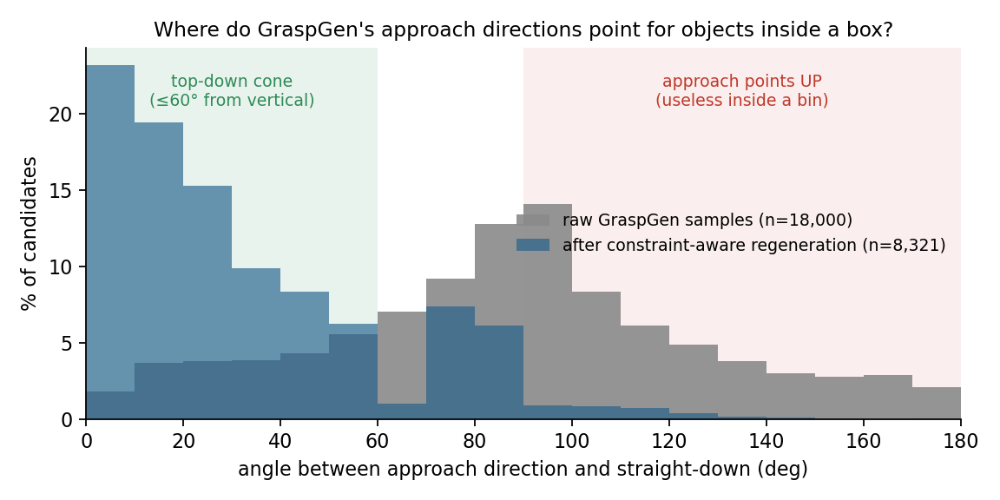
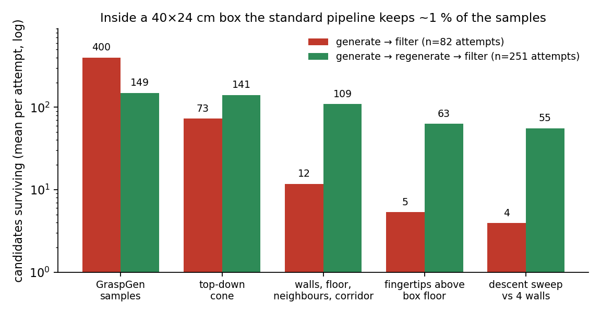
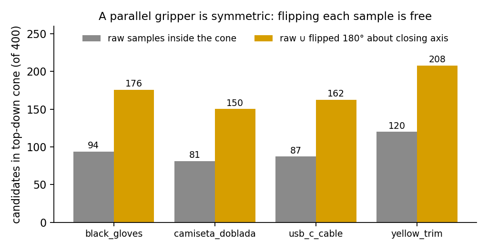
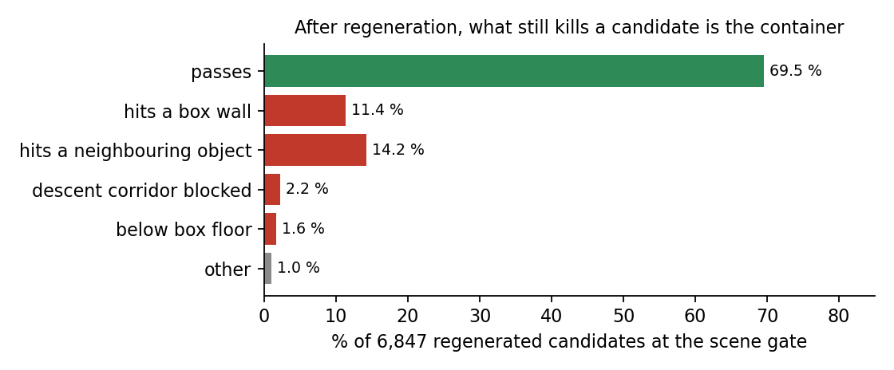

# GraspGen inside a container: measurements from a bin-picking cell

**What this is.** Numbers, figures and per-candidate data from running NVIDIA's
[GraspGen](https://github.com/NVlabs/GraspGen) / GraspGen-X as the grasp generator of a
bin-picking cell in simulation: a UR5e with a parallel gripper picking rigid objects
and garments out of a cardboard box. Everything here is measured, nothing is tuned for
the plot. Scripts under `scripts/` regenerate every figure from the CSVs under `data/`.

**Why we measured it.** GraspGen is trained on free-floating objects with SO(3)
augmentation. On a table that is fine: you keep the top-down samples and discard the
rest. **Inside a container it is not fine.** Every candidate has to clear four walls, a
floor and whatever else is in the box, and the standard pipeline
(*generate → filter by collision → rank*) can only *remove* candidates. It cannot create
the ones the sampler never produced. The consequence, measured over 82 attempts inside a
40 × 24 cm box: **of 400 samples, 4 survive on average**, and the 4 that survive are not
the good ones. This repository documents that, and the two things that fixed it for us.

> Setting: Isaac Sim 6.0.1 · UR5e · WSG-50 parallel gripper (110 mm stroke) ·
> wrist RGB-D → segmented object point cloud → GraspGen-X (parallel-jaw descriptor,
> 400 samples per object) · cardboard box, inner floor 40.2 × 24.0 cm, walls 14.4 cm ·
> objects: gloves, socks, mesh bag, folded t-shirt (FEM cloth), mouse, drill, cube,
> USB cable, trim · motion planning with cuRobo.

---

## 1. Half of the samples point away from the box floor

Approach direction of the 400 raw samples, for 45 attempts (18,000 candidates) on
objects lying inside the box. 0° = straight down, 180° = straight up.



| | raw samples |
|---|---|
| approach points **up** (> 90° from vertical) | **47.9 %** (per attempt: min 165, max 235 of 400) |
| inside a 60° top-down cone | 23.1 % |

The raw distribution is close to uniform over the sphere, which is what SO(3)
augmentation on floating objects produces. The sampler does not know a floor exists,
let alone a box. This is the same bias reported in
[NVlabs/GraspGen#22](https://github.com/NVlabs/GraspGen/issues/22) ("mostly side grasps");
in our traces it is already present in the raw samples, before any discriminator scoring.

## 2. Inside a box, the filters keep ~1 % of the samples

Mean survivors per gate, one row per (object, object pose) attempt inside the box.
Gates, in order: top-down cone (≤ 60°); swept gripper volume vs. walls, floor,
neighbouring objects and the descent corridor; fingertips above the box floor at the
post-descent pose; full descent sweep against the four walls.



| pipeline | attempts | samples | after cone | after scene | after floor gate | after wall sweep | pick + place OK |
|---|---|---|---|---|---|---|---|
| generate → filter | 82 | 400 | 72.5 | 11.8 | 5.3 | **3.9** | 33 / 77 |
| generate → **regenerate** → filter | 251 | 400 → 148.9 | 140.6 | 109.4 | 63.0 | **55.4** | 131 / 245 |

Two things to notice:

1. **The container is the killer, not the cone.** The cone removes 82 % of the samples,
   but the *scene* gate (walls, floor, neighbours) then removes 84 % of what is left,
   and the wall sweep a further third. On a table the scene gate is nearly a no-op.
2. **Fewer candidates means worse candidates.** With 4 survivors there is nothing to
   rank. The survivors near a wall are systematically the perpendicular or nearly
   vertical ones, which grab the least material. In our logs the failure mode moved
   from "no plan" to "grasped and slipped": the system does not fail to find a grasp,
   it confidently executes a bad one.

> The success-rate columns are **not** a clean A/B: the two groups come from different
> weeks of development and other parts of the pipeline changed in between. The
> candidate counts are the clean measurement; treat the outcomes as an order of
> magnitude. A controlled comparison is in preparation.

## 3. Fix 1, free: flip every sample 180° about the closing axis

A symmetric parallel gripper closes along one axis. Rotating a grasp 180° about that
axis, **around the contact point** (not the gripper origin, which would move the contact
by tens of centimetres), keeps both fingertip contacts and reverses the approach: a
sample that entered from below now enters from above, grasping exactly the same thing.
With the flipped copies added, the candidates inside the top-down cone go from
**92 to 170 per 400 (+84 %)** at zero inference cost. They still have to pass the scene
gates, so this is a supply fix, not a guarantee.



## 4. Fix 2: regenerate under the container's constraints instead of filtering

The sampler is good at saying **where** to grasp (the contact on the object) and, inside
a box, bad at saying **how** (the orientation). So instead of discarding a candidate
that would hit a wall, we keep its contact point and search the admissible orientation
closest to the original: rotations of the closing line about the approach axis, tilts,
and the 180° flip, each checked against the box walls, the floor, neighbouring objects
and the arm's descent corridor, using the gripper's real jaw width for the wall sweep.
If no orientation fits, the contact is in a **dead zone** and
the candidate is dropped: that is information, not a failure. Confidence is then
re-scored with GraspGen's own discriminator on the *new* pose (the inherited confidence
was a median of 40° away from the pose actually executed).

Measured effect on the same gates (table above): survivors after the wall sweep go from
**3.9 to 55.4 per attempt**, and after regeneration **82 % of the candidates sit inside
the top-down cone** (23 % before). The dead zone is large: on average **253 of the 400
contact points admit no orientation at all** inside the box, and it grows with object
size (the largest garment, 30 cm, loses 253–276 samples; the smallest, 18 cm, 40–184).

What still kills a regenerated candidate is, again, the container:



The write-up of the regeneration method, with baselines and ablations, is in
preparation. This repository only contains the diagnosis and the flip.

## 5. Two questions we would like answered

1. Is contact with large static obstacles (a box wall a few millimetres from the
   object) considered in-distribution for GraspGen, or is the intended usage to crop
   the scene so that the object appears free-floating?
2. For the orientation bias of [#22](https://github.com/NVlabs/GraspGen/issues/22): in our
   traces it is present at sampling time. Is that expected from the training
   augmentation, and would a floor-aware conditioning be in scope?

## Data

| file | content |
|---|---|
| `data/candidate_angles.csv` | one row per candidate: attempt, object, stage (`raw` / `regenerated`), angle between approach direction and straight-down |
| `data/per_trace_summary.csv` | one row per attempt: samples pointing up, inside the cone, inside the cone with flip, regenerated count |
| `data/funnel_per_cell.csv` | one row per (object, pose) attempt inside the box: survivors after each gate, regeneration on/off, outcome |
| `data/scene_gate_reasons.csv` | why regenerated candidates die at the scene gate |
| `data/examples/<object>.npz` | full example per object: `object_cloud` (N×3, world frame, metres), `raw_grasps` (400×4×4, GraspGen convention: +Z approach, X closing line), `regenerated_grasps` |

Object poses P1–P4 in `funnel_per_cell.csv` are object orientations (canonical, lying,
on edge, upside-down), not positions in the box.

## Reproduce

```bash
pip install -r requirements.txt
python scripts/make_figures.py      # figures/ + headline numbers, from data/
```

`scripts/export_from_traces.py` and `scripts/parse_logs.py` document how the CSVs were
produced from the cell's per-candidate traces and run logs (not published; multi-GB).

## Who

Jesús Merino and Jorge Pascual, [NEURYN Robotics](https://neurynrobotics.com), Madrid.
Robot learning for garment handling. Contact: through GitHub or the website.

MIT license.
