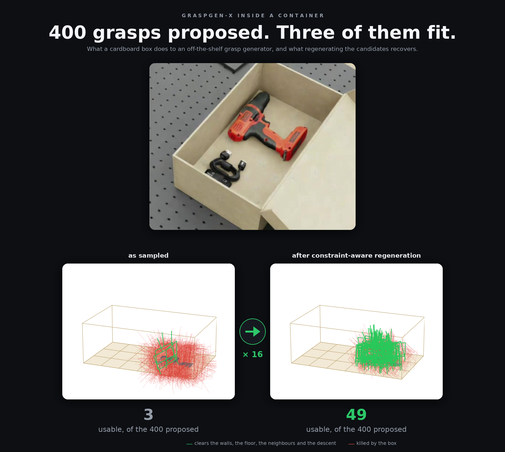
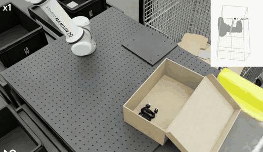
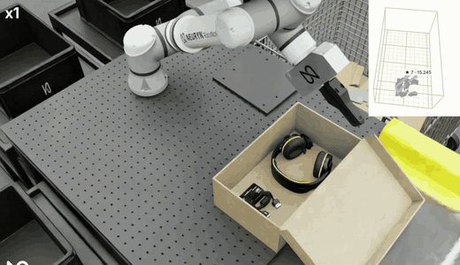
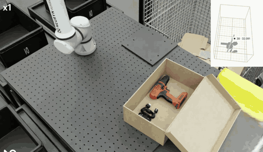

# GraspGen-X inside a container

**Bin-picking measurements on top of [NVIDIA GraspGen-X](https://github.com/NVlabs/GraspGenX)**

<p>
<a href="https://github.com/NVlabs/GraspGenX"></a>
<a href="https://arxiv.org/abs/2606.00998"></a>
<a href="https://developer.nvidia.com/isaac/sim"></a>

</p>



<sub>Every candidate GraspGen-X proposed for the cable, drawn the way the cell's own
funnel viewer draws it. Both runs use the same seeded drop, so the only difference between
them is the regeneration. Numbers and method in §4.</sub>

<table>
  <tr>
    <td align="center"><br><sub>USB-C cable</sub></td>
    <td align="center"><br><sub>headphones</sub></td>
    <td align="center"><br><sub>drill</sub></td>
  </tr>
</table>

<sub>Three complete picks at 1× speed: the descent between the walls, the close and the
lift. The panel in each corner is the cell's live candidate view. Full 2:26 recording:
[media/cell_demo.mp4](https://github.com/jesusmerinomar/graspgenx-bin-analysis/blob/main/media/cell_demo.mp4).</sub>

**What this is.** Measurements from running
[GraspGen-X](https://github.com/NVlabs/GraspGenX) (`b942909`) as the grasp generator of a
bin-picking cell in simulation — a UR5e with a WSG-50 parallel gripper emptying a
cardboard box — plus the per-candidate data behind every number. GraspGen-X is used
unmodified and no code of theirs is copied here.

- **The problem.** It is trained on free-floating objects. Inside a box every candidate
  has to clear four walls, a floor and its neighbours, and filtering can only *remove*
  candidates — it cannot create the ones the sampler never proposed.
- **The measurement.** Of 400 samples, **3 to 17 are usable** depending on the object.
- **The fix.** Regenerate each candidate under the container's constraints instead of
  discarding it: **up to 16× more usable grasps** (§4).

<details>
<summary>Setup</summary>

Isaac Sim 6.0.1 · UR5e · WSG-50 parallel gripper (110 mm stroke) · wrist RGB-D →
segmented object point cloud → GraspGen-X (parallel-jaw descriptor from
`gripper/wsg50_long/config.json`, 400 samples per object) · cardboard box, inner floor
40.2 × 24.0 cm, walls 14.4 cm · objects: gloves, socks, mesh bag, folded t-shirt (FEM
cloth), mouse, drill, cube, USB cable, trim · motion planning with cuRobo.

Nothing here is tuned for the plot, and `scripts/` regenerates every figure from `data/`.
`scripts/run_graspgenx_on_example.py` reproduces our starting point against their own
sampler, so every number traces back to it.

</details>

---

## 1. Half of the samples point away from the box floor

Approach direction of the 400 raw GraspGen-X samples, for 45 attempts (18,000 candidates) on
objects lying inside the box. 0° = straight down, 180° = straight up.


| | raw samples |
|---|---|
| approach points **up** (> 90° from vertical) | **47.9 %** (per attempt: min 165, max 235 of 400) |
| inside a 60° top-down cone | 23.1 % |

The raw distribution is close to uniform over the sphere, which is what SO(3)
augmentation on floating objects produces. The sampler does not know a floor exists,
let alone a box. This is the same bias reported in
[NVlabs/GraspGen#22](https://github.com/NVlabs/GraspGen/issues/22) ("mostly side grasps");
in our traces it is already present in the raw samples, before any discriminator scoring.

## 2. Inside a box, the filters keep ~1 % of the samples

Mean survivors per gate, one row per (object, object pose) attempt inside the box.
Gates, in order: top-down cone (≤ 60°); swept gripper volume vs. walls, floor,
neighbouring objects and the descent corridor; fingertips above the box floor at the
post-descent pose; full descent sweep against the four walls.


| pipeline | attempts | samples | after cone | after scene | after floor gate | after wall sweep | pick + place OK |
|---|---|---|---|---|---|---|---|
| generate → filter | 82 | 400 | 72.5 | 11.8 | 5.3 | **3.9** | 33 / 77 |
| generate → **regenerate** → filter | 251 | 400 → 148.9 | 140.6 | 109.4 | 63.0 | **55.4** | 131 / 245 |

**The container is the killer, not the cone.** The cone removes 82 % of the samples,
but the scene gate (walls, floor, neighbours) removes 84 % of what is left. On a table
that gate is nearly a no-op. And with 4 survivors there is nothing left to rank: the
failure mode moves from "no plan" to "grasped and slipped".

<details>
<summary>Caveat on the success-rate columns</summary>

They are not a clean A/B: the two groups come from different weeks of development and
other parts of the pipeline changed in between. The candidate counts are the clean
measurement; treat the outcomes as an order of magnitude.

</details>

## 3. Fix 1, free: flip every sample 180° about the closing axis

A symmetric parallel gripper closes along one axis. Rotating a grasp 180° about that
axis, **around the contact point** (not the gripper origin, which would move the contact
by tens of centimetres), keeps both fingertip contacts and reverses the approach: a
sample that entered from below now enters from above, grasping exactly the same thing.
With the flipped copies added, the candidates inside the top-down cone go from
**92 to 170 per 400 (+84 %)** at zero inference cost. They still have to pass the scene
gates, so this is a supply fix, not a guarantee.


## 4. Fix 2: regenerate under the container's constraints instead of filtering

The sampler is good at saying **where** to grasp (the contact on the object) and, inside
a box, bad at saying **how** (the orientation). So instead of discarding a candidate that
would hit a wall, we keep its contact point and look for an orientation that fits the
container.

Every candidate the cell had to choose from, drawn the way its own funnel viewer draws
them: red if the container kills it, green if it clears the walls, the floor, the
neighbours and the whole descent. Two runs of the same batch of three objects, with the
drop seeded so the arrangement is **identical** in both — the only difference is the
regeneration:

| object | generate → filter | generate → regenerate → filter |
|---|---|---|
| `usb_c_cable`, flat on the box floor (the cover) | **3** usable of 400 | **49** usable |
| `usb_c_cable`, other batch | 9 usable of 400 | 39 usable |
| `yellow_trim`, tall, reaching near the rim | 17 usable of 400 | 72 usable |
| `power_drill`, bulky | 11 usable of 400 | **7 usable** |

**The drill is the case where this does not pay off**, and it is worth stating plainly.
Regenerating it drops 285 of the 400 contacts into a dead zone — no orientation of the
gripper fits between the walls for those contact points — and the 115 that survive yield
fewer usable grasps than filtering the raw samples did. The gain is largest exactly where
the sampler struggles most: small or flat objects lying deep in the container. For a bulky
object that already has viable top-down grasps, there is nothing to recover.


The method itself, with baselines and ablations, is being written up separately.

<details>
<summary>An earlier pair of runs, and how far these numbers go</summary>

Before the drop was seeded, two runs of the same batch gave the same picture:
`yellow_trim` 32 → 84 usable, `usb_c_cable` 8 → 46. Those two runs are not the same
physical arrangement, which is why the seeded pair above replaced them.

Four pairs of picks are not a statistic. The aggregate over the runs measured in §2 is
3.9 survivors per attempt without regeneration and 55.4 with it.

</details>

## 5. The sampler's confidence cannot pick the grasp inside a box

Its confidence does not predict whether a candidate fits: **AUC 0.45** over 6,847
candidates, slightly worse than a coin flip. Of the 8 highest-confidence candidates per
attempt, **1.4 fit in the box**.


It was trained on rigid meshes, so it scores stability, not whether the jaws close on
material — which on cloth is the whole question. What a ranking has to look at instead,
and why it differs per object class: [docs/ranking.md](docs/ranking.md).

## 6. Two questions we would like answered

1. Is contact with large static obstacles (a box wall a few millimetres from the
   object) considered in-distribution for GraspGen, or is the intended usage to crop
   the scene so that the object appears free-floating?
2. For the orientation bias of [#22](https://github.com/NVlabs/GraspGen/issues/22): in our
   traces it is present at sampling time. Is that expected from the training
   augmentation, and would a floor-aware conditioning be in scope?

<details>
<summary><b>Data</b></summary>

| file | content |
|---|---|
| `data/candidate_angles.csv` | one row per candidate: attempt, object, stage (`raw` / `regenerated`), angle between approach direction and straight-down |
| `data/per_trace_summary.csv` | one row per attempt: samples pointing up, inside the cone, inside the cone with flip, regenerated count |
| `data/funnel_per_cell.csv` | one row per (object, pose) attempt inside the box: survivors after each gate, regeneration on/off, outcome |
| `data/seed7/*.npz` | the seeded pair behind the figure in §4 (`yt_` = yellow_trim, otherwise usb_c_cable): every candidate, whether it clears the container, and the object cloud |
| `data/gate_comparison/*.npz` | the earlier, unseeded pair of runs quoted at the end of §4 |
| `data/scene_gate_reasons.csv` | why regenerated candidates die at the scene gate |
| `data/confidence_vs_feasibility.csv` | one row per candidate: discriminator confidence and whether it survived the container gates |
| `gripper/wsg50_long/config.json` | the WSG-50 descriptor we feed to GraspGen-X (their wizard format) |
| `data/examples/<object>.npz` | full example per object: `object_cloud` (N×3, world frame, metres), `raw_grasps` (400×4×4, GraspGen convention: +Z approach, X closing line), `regenerated_grasps` |

Object poses P1–P4 in `funnel_per_cell.csv` are object orientations (canonical, lying,
on edge, upside-down), not positions in the box.

</details>

<details>
<summary><b>Reproduce</b></summary>

```bash
pip install -r requirements.txt
python scripts/make_figures.py       # figures/ + headline numbers, from data/
python scripts/make_hero.py          # the cover, from data/seed7/ + figures/src/
```

```bash
# reproduce the starting point with GraspGen-X itself (needs their repo + checkpoints + a GPU)
GRASPGENX_CHECKPOINTS=<ckpt root> python scripts/run_graspgenx_on_example.py yellow_trim
```

`scripts/export_from_traces.py` and `scripts/parse_logs.py` document how the CSVs were
produced from the cell's per-candidate traces and run logs (not published; multi-GB).

</details>

<details>
<summary><b>Citing GraspGen-X</b></summary>

Everything here builds on their model. If you use this repository, cite their work:

```bibtex
@inproceedings{graspgenx2026,
  title     = {GraspGen-X: Cross-Embodiment 6-DOF Diffusion-based Grasping},
  author    = {Han, Beining and Chao, Yu-Wei and Coumans, Erwin and Eppner, Clemens
               and Sundaralingam, Balakumar and Deng, Jia and Birchfield, Stan
               and Murali, Adithyavairavan},
  booktitle = {Proceedings of the IEEE/CVF Conference on Computer Vision and
               Pattern Recognition (CVPR)},
  year      = {2026},
}
```

Thanks to the GraspGen-X authors for releasing the model, the checkpoints and the
gripper wizard; without them none of this would exist.

</details>

## Who

Jesús Merino and Jorge Pascual, [NEURYN Robotics](https://neurynrobotics.com), Madrid.
Robot learning for garment handling. Contact: through GitHub or the website.

MIT license.
