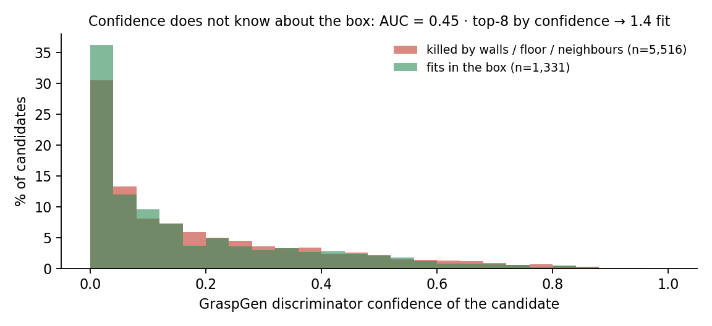

# Choosing among the survivors

Notes behind §5 of the [README](../README.md).

Once candidates survive the container, one has to be chosen. GraspGen ships a
discriminator whose confidence ranks its own samples, and on a free-standing rigid
object that is a reasonable choice. Inside a container, with garments, it is not.

## It does not know about the box

We took the discriminator's confidence of each candidate and asked whether it predicts
surviving the container gates (walls, floor, neighbours, descent sweep). It does not:
**AUC 0.45** over 6,847 candidates, slightly worse than a coin flip, and of the 8
highest-confidence candidates per attempt only **1.4 fit in the box**.

## It does not know what a good closure is on our objects

The discriminator was trained to tell a stable grasp from an unstable one on rigid
meshes. Whether the jaws will close on *material*, and on the right material, is a
different question, and on cloth it is the whole question. Over 328 closure/outcome
pairs from our logs, the shape of the closure predicts the pick far better than any
score assigned before it:

| how the jaws closed | pick + place OK |
|---|---|
| both jaws stopped on material, symmetrically | 205 / 277 · **74 %** |
| one jaw stopped, the other went to its stop | 2 / 12 · 17 % |
| both jaws went to their stop (closed on nothing) | 1 / 39 · **3 %** |

## What a ranking has to look at instead

On the object's own point cloud, and differently for different objects:

- **where the centre of mass sits** relative to the closing line: off-centre grasps of a
  rigid object twist and slip; on a garment the same offset is harmless;
- **how much material ends up between the fingertips**, and whether it is the part the
  closure was aimed at or a fold that will slide out;
- **where the fingertips land**: on a rigid object a fingertip landing *on* the object is
  a collision and must be vetoed; on cloth the material does not stop at the jaw, so the
  same rule vetoes almost every candidate;
- **whether the closing line crosses the feature** (a cuff, a handle, a fold) or runs
  along it, and whether it pinches the tip, from where it slips;
- **verticality**, only as a mild tie-breaker;
- the sampler's confidence, used as a **floor** rather than as the score: the network's
  *no* travels much better than its *yes*.

The weights, and which of these terms is a veto and which a multiplier, depend on the
object class. That part stays in the cell.

⚠ The closure/outcome table is quoted from an offline analysis of the cell's run logs;
unlike the rest of this repository it is not regenerable from the data published here.
